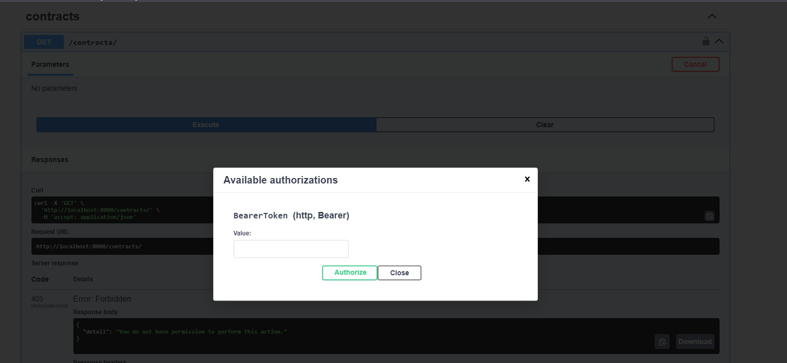
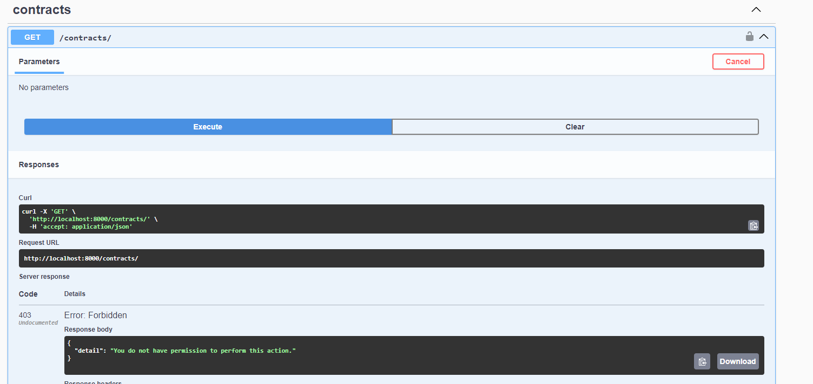
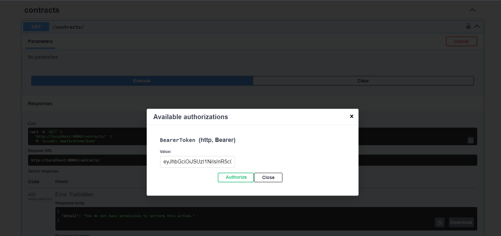
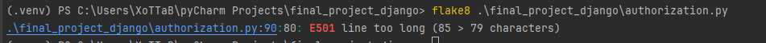

# Django Final Project

## Install

1. Clone this repository on your PC. You must have a preset Docker.
2. Change `.env.def` name to `.env`. Then change the values of the variables in this file.
3. In local repository open console and write down these commands:

```
docker-compose up -d
docker container list -a
```
(Take web container ID) 
```
docker exec <Container ID> python .\manage.py migrate
```
4. Add Realm Role, User in Keycloak. Regenerate Client Creditinals, take this and write this in `.env` file.

## Testing

1. GET Contracts without Bearer Token from Keycloak.




2. GET Contracts with Bearer Token from Keycloak.



## SAST Testing(flake8)
### Before

### After


# SAST Testing(pylint)
### Before

### After

